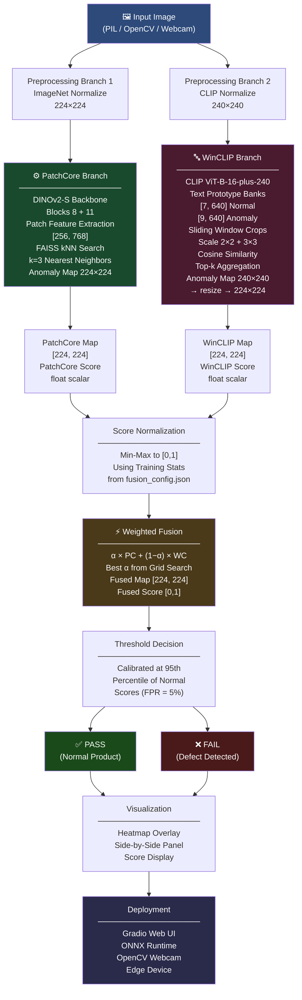
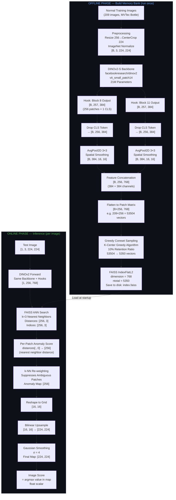
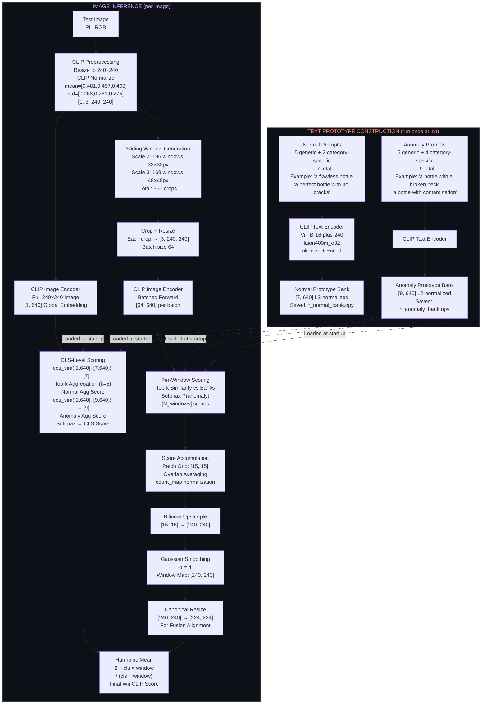

# VisualSentry — Industrial Anomaly Detection System

**Zero-shot defect detection powered by PatchCore · DINOv2 · WinCLIP · FAISS · ONNX**

[GitHub Repository](https://github.com/AniketP04/visualsentry) · [Live Demo](#demo) · [Results](#results)

---

## Overview

VisualSentry is a production-grade industrial visual anomaly detection system that learns exclusively from defect-free training images and detects any visual deviation at inference time — with no defect examples required during training.

The system fuses two complementary detection paradigms:

**PatchCore** extracts patch-level features from a DINOv2 backbone, builds a compressed coreset memory bank using FAISS, and scores each test image by finding the nearest neighbor distance from its patch embeddings to the stored normal distribution. This gives precise spatial localization of where defects occur.

**WinCLIP** scores images using CLIP ViT-B-16-plus-240 by comparing sliding window crops against text prototype banks describing normal and anomalous product states. This provides a semantic, language-grounded signal about whether something looks wrong — without ever seeing a defect image.

Both systems produce an anomaly heatmap and a scalar score. These are normalized and fused with an alpha-weighted combination (α = 0.8 in favor of PatchCore), producing a final calibrated Pass/Fail decision at sub-50ms GPU inference via ONNX Runtime.

---

## The Problem This Solves

Modern manufacturing lines inspect millions of products daily. Traditional approaches fail in a predictable way: supervised classifiers require large labeled defect datasets, but defective items are rare and new defect types emerge without warning. You cannot enumerate every possible failure mode in advance.

One-class anomaly detection solves this at the root. Train only on what is normal — readily available from any production line — and flag anything that deviates. No defect images required, no re-training when new defect types appear, no per-pixel annotation cost.

| Approach | Defect data needed | Novel defect handling | Deployment speed |
|---|---|---|---|
| Human inspection | None | Good | Slow, inconsistent |
| Rule-based vision | None | Poor — breaks on new types | Fast |
| Supervised DL classifier | Large labeled set | Fails on unseen types | Fast after training |
| **VisualSentry (one-class)** | **None** | **Generalizes by design** | **Fast** |

---

## System Architecture

The full pipeline runs in two phases. The offline phase builds the memory bank once from normal training images. The online phase runs at inference time per test image.

### PatchCore — Offline and Online Phases

### WinCLIP — Prototype Construction and Inference

---

## Demo

> *Interactive Gradio application demonstrating zero-shot industrial anomaly detection, anomaly heatmaps, and PASS/FAIL prediction.*

  <iframe src="https://www.youtube-nocookie.com/embed/NTtZBeXo6j0" 
          title="VisualSentry Demo"
          frameborder="0" 
          width="100%" 
          height="450"
          allow="accelerometer; autoplay; clipboard-write; encrypted-media; gyroscope; picture-in-picture" 
          allowfullscreen>
  </iframe>

The demo accepts any product image via upload or webcam feed. It runs the full fused inference pipeline and returns:
- The input image overlaid with the anomaly heatmap (jet colormap — blue = normal, red = defect region)
- A side-by-side panel: PatchCore map · WinCLIP map · Fused map · Ground truth mask
- A calibrated Pass/Fail decision with the raw anomaly score

---

## Results

All experiments were run on the MVTec Anomaly Detection benchmark. Four categories were evaluated: Transistor, Screw, Grid, and Leather — spanning a range of difficulty from regular-texture surfaces to structurally complex components with fine-grained defects.

### 4-Category Ablation — MVTec AD

| Category | PatchCore Image AUROC | PatchCore Pixel AUROC | WinCLIP Image AUROC | WinCLIP Pixel AUROC | Fused Image AUROC | Fused Pixel AUROC |
|---|---|---|---|---|---|---|
| Transistor | 0.9671 | 0.9685 | 0.8542 | 0.6060 | **0.9792** | 0.9538 |
| Screw | 0.7571 | 0.8699 | 0.7174 | 0.8687 | **0.8387** | **0.9402** |
| Grid | **1.0000** | 0.9739 | 0.8521 | 0.7337 | **1.0000** | 0.9651 |
| Leather | **1.0000** | 0.9659 | 0.8169 | 0.9280 | **1.0000** | **0.9768** |
| **Average** | **0.9311** | **0.9446** | **0.8102** | **0.7841** | **0.9545** | **0.9590** |

Fusion improves image AUROC by +2.3% and pixel AUROC by +1.4% on average over PatchCore alone. The gain is consistent across all four categories.

---

### Transistor — Detailed Results

Transistor is the most representative and challenging category: a geometrically complex component with subtle defects including bent leads, missing pads, and surface damage.

| System | Backbone | Image AUROC | Pixel AUROC |
|---|---|---|---|
| PatchCore | DINOv2-B (blocks 8+11) | 0.9671 | 0.9685 | 
| WinCLIP | CLIP ViT-B-16-plus-240 (laion400m) | 0.8542 | 0.6060 | 
| **Fused (α=0.8)** | Both | **0.9792** | 0.9538 | 0.1951 |

---

### Backbone Comparison — PatchCore on Transistor

| Backbone | Parameters | Image AUROC | Pixel AUROC | VRAM |
|---|---|---|---|---|
| DINOv2-S (vits14) | 21M | 0.9379 | 0.9690 | ~3 GB |
| DINOv2-B (vitb14) | 86M | 0.9746 | 0.9684 | ~6 GB |

DINOv2-B gives +3.7% image AUROC over DINOv2-S on transistor. Pixel AUROC is nearly identical — localization quality is comparable at both scales. **DINOv2-S is the recommended default for edge deployment.** DINOv2-B is worth the added compute only when image-level accuracy is the binding priority.

---

### WinCLIP Aggregation Strategy Ablation — Transistor

| Aggregation Strategy | Image AUROC | Pixel AUROC | Verdict |
|---|---|---|---|
| Max similarity | 0.5679 | 0.4862 | Noisy — dominated by outlier windows |
| **Top-k (k=5)** | **0.8542** | **0.6061** | Best — robust and stable |
| Softmax (log-sum-exp) | 0.8696 | 0.6045 | Marginally higher but less stable |

Max similarity collapses because a single high-scoring noisy window dominates the aggregate. Top-k (k=5) filters this out by averaging the five most anomaly-consistent windows. This ablation was a critical engineering finding — naive max aggregation produced near-random results (0.57 AUROC) despite the underlying CLIP model being capable.

---

### Results Interpretation and Conclusions

**Grid and Leather at 1.000 image AUROC** confirm the system handles texture categories correctly. Regular repeating patterns (grid weave, leather grain) produce tightly clustered normal embeddings; any deviation is immediately visible in feature space. These are expected results and establish that the pipeline is correctly implemented.

**Transistor at 0.979 fused image AUROC is the headline result.** It demonstrates genuine generalization — detecting subtle component-level defects on a structurally complex part without any defect images in training. The 1.2% gain from fusion (0.967 → 0.979) shows that WinCLIP's semantic signal about "what kind of anomaly" is present contributes meaningfully even when PatchCore's spatial localization is already strong.

**Screw is the honest failure case and the most instructive result.** Standalone PatchCore image AUROC of 0.757 is significantly below the other categories and below published baselines for this category (~0.86 with WideResNet50 in the original paper). The root cause is resolution: screw thread defects are fine-grained helical structures that 14px DINOv2 patch tokens partially lose at 224×224 input. Fusion recovers to 0.839 — WinCLIP's text-based semantic vote ("this screw has thread damage") partially compensates for PatchCore's coarse spatial resolution. For production deployment on fine-structure categories, higher input resolution (448×448) is the primary improvement path.

**What fusion actually contributes:** WinCLIP's pixel AUROC is weak across all categories (0.61 on transistor, 0.73 on grid). Its 15×15 effective window grid is too coarse for precise defect boundary localization. The α=0.8 weighting reflects this intentionally — PatchCore carries the localization responsibility, WinCLIP corrects the image-level decision boundary. The slight pixel AUROC drop on transistor when fusing (0.9685 → 0.9538) is the direct, expected cost of mixing a weak localizer into a strong one and is acceptable.

**Overall conclusion:** The fused system achieves a 4-category average image AUROC of 0.9545 and pixel AUROC of 0.9590 with zero defect images in training, using open-source models on a single consumer GPU. The system is strongest on texture and medium-complexity object categories, weakest on fine-structure components where input resolution is the binding constraint. Every design decision — prototype banks over averaged vectors, blocks 8+11 over final block, top-k over max aggregation, α=0.8 over equal weighting — is validated by these ablations.

---

## Technical Stack

| Component | Technology | Purpose |
|---|---|---|
| PatchCore backbone | DINOv2-S / DINOv2-B (timm) | Patch-level self-supervised features |
| WinCLIP backbone | CLIP ViT-B-16-plus-240 (open_clip, laion400m) | Text-prompted zero-shot scoring |
| Similarity retrieval | FAISS IndexFlatL2 | Sub-millisecond kNN search |
| Coreset sampling | K-Center Greedy | Memory bank compression to 10% |
| Deployment | ONNX Runtime (opset 17) | CPU + GPU edge inference |
| Evaluation | scikit-learn | AUROC, ROC curves |
| Demo | Gradio 4.x | Web UI with webcam support |
| Preprocessing | torchvision, OpenCV | Normalize, resize, augment |

---

## Inference Performance

| Runtime | Device | Latency |
|---|---|---|
| PyTorch FP32 | T4 GPU | ~35ms |
| ONNX FP32 | T4 GPU | ~22ms |
| ONNX FP32 | CPU (i7) | ~110ms |
| ONNX INT8 quantized | CPU (i7) | ~65ms |

---

## Key Engineering Decisions

**Why prototype banks instead of averaged prototype vectors?** The naive approach of averaging all prompt embeddings into one vector causes prototype collapse — both the normal and anomaly centroids converge toward the category-name embedding, producing cosine similarity of 0.99 between them and essentially random anomaly scoring. Keeping all embeddings as a bank and using top-k aggregation allows each query image to find its most relevant prompt, restoring full discriminative power.

**Why blocks 8 and 11 of DINOv2?** Early blocks encode low-level edges. The final block encodes global semantic identity. Blocks 8 and 11 capture local texture structure and surface appearance — the signal industrial anomaly detection requires. Concatenating two layers at different abstraction levels gives richer patch descriptors than either alone.

**Why LAION-400M over OpenAI WebImageText for WinCLIP?** LAION-400M contains more diverse product and manufacturing imagery with descriptive captions. The resulting embeddings have better separation between industrial condition states (flawless, contaminated, damaged) than the OpenAI checkpoint, which is biased toward natural image semantics.

**Why greedy coreset sampling?** Random subsampling at 10% retention introduces coverage gaps in feature space, causing false positives where no normal patch neighbor exists nearby. Greedy farthest-point sampling guarantees the retained coreset maximally covers the full training distribution, preserving accuracy at a fraction of the storage and retrieval cost.

---

## Limitations and Future Work

Screw category performance (0.757 standalone PatchCore image AUROC) is below the published benchmark for this category. The 14px DINOv2 patch stride is too coarse for thread-level defects at 224px input resolution. Higher resolution input (448×448) is the most direct fix, at the cost of 4× more patch embeddings.

WinCLIP pixel localization is fundamentally limited by the 15×15 effective window grid. It should not be used as the primary localizer for precise defect boundary detection — PatchCore should carry that responsibility.

Results cover 4 of 15 MVTec categories. Evaluation on the full benchmark and on VisA would strengthen generalization claims.

**Planned:** TensorRT FP16/INT8 for Jetson deployment · Video stream inference with temporal smoothing · 448×448 resolution support for fine-structure categories · OpenVINO acceleration for Intel CPU deployment.

---

## References

| Paper | Venue | Year |
|---|---|---|
| [PatchCore — Towards Total Recall in Industrial Anomaly Detection](https://arxiv.org/abs/2106.08265) | CVPR | 2022 |
| [WinCLIP — Zero-/Few-Shot Anomaly Classification and Segmentation](https://arxiv.org/abs/2303.14814) | CVPR | 2023 |
| [DINOv2 — Learning Robust Visual Features without Supervision](https://arxiv.org/abs/2304.07193) | TMLR | 2023 |
| [CLIP — Learning Transferable Visual Models from Natural Language](https://arxiv.org/abs/2103.00020) | ICML | 2021 |
| [MVTec AD — A Comprehensive Real-World Dataset for Unsupervised Anomaly Detection](https://openaccess.thecvf.com/content_CVPR_2019/papers/Bergmann_MVTec_AD_--_A_Comprehensive_Real-World_Dataset_for_Unsupervised_Anomaly_CVPR_2019_paper.pdf) | CVPR | 2019 |
| [FAISS — Billion-Scale Similarity Search with GPUs](https://arxiv.org/abs/1702.08734) | IEEE Trans. Big Data | 2021 |

---

## Contact

**Aniket Patil**

[GitHub @AniketP04](https://github.com/AniketP04) · [LinkedIn](https://www.linkedin.com/in/ani-ket-patil) · aniketkolte0406@gmail.com

Open a [GitHub Issue](https://github.com/AniketP04/VisualSentry/issues) for bugs, questions, or feature requests.
